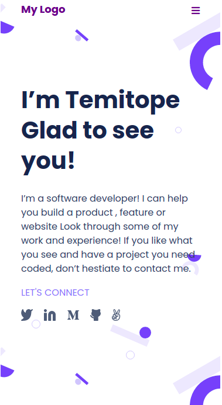

# Portfolio

> Portfolio: setup and mobile version skeleton.

Additional description about the project and its features.

## Built With

- HTML, CSS
- stylelint

## Getting Started
To get a local copy up and running follow these simple example steps.

### Prerequisites
live server vscode extention
### Setup
Open with live server on vscode
### Install
no installations

## Authors

👤 **Author1**

- GitHub: [@githubhandle](https://github.com/topeogunleye)
- Twitter: [@twitterhandle](https://twitter.com/topeogunleye21)
- LinkedIn: [LinkedIn](https://linkedin.com/in/ogunleye)

## 🤝 Contributing

Contributions, issues, and feature requests are welcome!

Feel free to check the [issues page](https://github.com/topeogunleye/Portfolio-1/issues).

## Show your support

Give a ⭐️ if you like this project!

## 📝 License

This project is [MIT](./MIT.md) licensed.